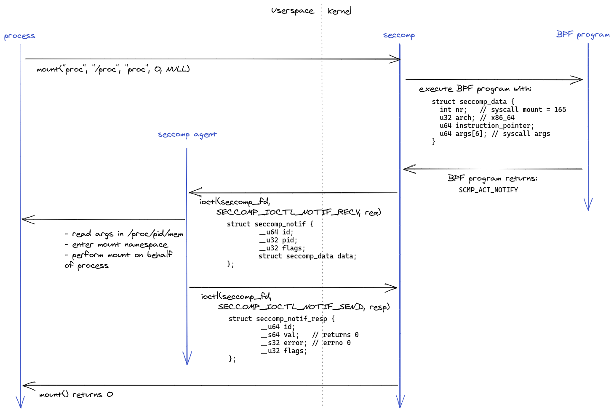
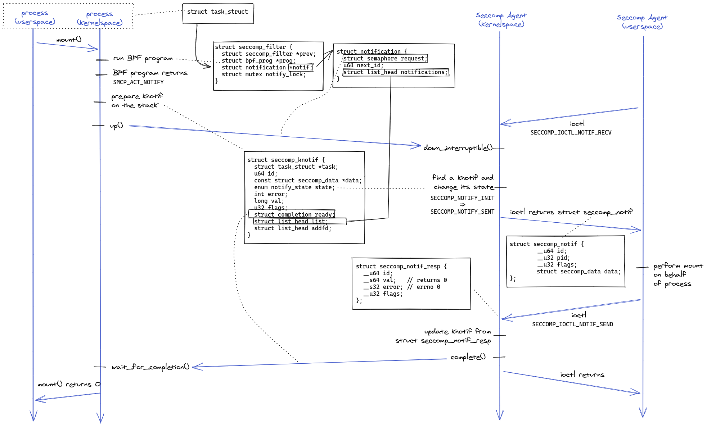

## From Kubernetes to Seccomp Agent

In this example, we use containerd but this can be with other container runtimes.


Steps:
- A user creates a pod with `kubectl apply -f pod.yaml`.
  The file `pod.yaml` specifies the seccomp profile `foo.json` as follows:
  ```
  apiVersion: v1
  kind: Pod
  metadata:
    name: mypod
  spec:
    securityContext:
      seccompProfile:
        type: Localhost
        localhostProfile: foo.json
  ```
- Once the pod is scheduled on a node, a Kubelet on a node receives the pod
  specification.
- The Kubelet calls the method
  [StartContainer](https://github.com/kubernetes/cri-api/blob/v0.22.0-alpha.2/pkg/apis/runtime/v1/api.proto#L65)
  on containerd using the
  [Container Runtime Interface (CRI)](https://github.com/kubernetes/cri-api).
  The method includes the field `SeccompProfilePath` with the value
  `/var/lib/kubelet/seccomp/foo.json`.
- Containerd reads the file `/var/lib/kubelet/seccomp/foo.json`:
  ```
  {
    "listenerPath": "/run/seccomp-agent.socket",
    "defaultAction": "SCMP_ACT_ALLOW",
    "syscalls": [
      {
        "names": ["mount"],
        "action": "SCMP_ACT_NOTIFY"
      }
  }
  ```
- Containerd prepares config.json that includes the file foo.json from above:
  ```
  {
    "linux": {
      "seccomp": {
        "listenerPath": "/run/seccomp-agent.socket",
        "defaultAction": "SCMP_ACT_ALLOW",
        "syscalls": [
          {
            "names": ["mount"],
            "action": "SCMP_ACT_NOTIFY"
          }
  ```
- Containerd starts runc with `config.json`.
- Runc gets the seccomp file descriptor by calling the seccomp() system call
  via libseccomp-golang.
- Runc sends the seccomp file descriptor to the seccomp agent, along with
  following
  [Container Process State](https://github.com/opencontainers/runtime-spec/blob/1c3f411f041711bbeecf35ff7e93461ea6789220/config-linux.md#containerprocessstate):
  ```
  {
    "ociVersion": "0.2.0",
    "fds": ["seccompFd"],
    "pid": 4422,
    "metadata": "",
    "state": {
      "ociVersion": "0.2.0",
      "id": "8eea9f6d...",
      "status": "creating",
      "pid": 4422,
      "bundle": "rootfs",
      "annotations": {}
    }
  }
  ```
- At this point, the Seccomp Agent has the seccomp file descriptor and the
  Container Process State contains the following
  [annotations](https://github.com/containerd/containerd/blob/v1.5.2/pkg/cri/annotations/annotations.go)
  to identify the pod. Additional information could be queried to the
  Kubernetes API.
  - Pod namespace: `io.kubernetes.cri.sandbox-namespace`
  - Pod name: `io.kubernetes.cri.sandbox-name`
  - Container name: `io.kubernetes.cri.container-name`

## Example of system call performed on behalf of the process

In this example, we use the mount system call because that was useful for the
unprivileged builds use case. But the mechanism is the same for other use
cases.



Steps:
- A process executes the mount system call:
  ```
  mount("proc", "/proc", "proc", 0, NULL)
  ```
- The seccomp subssytem in the kernel executes the BPF program for the
  seccomp filter.
  The BPF program receives a `struct seccomp_data` as argument, containing:
  ```
  struct seccomp_data {
    int nr;   // syscall mount = 165
    u32 arch; // x86_64
    u64 instruction_pointer;
    u64 args[6]; // syscall args
  }
  ```
- The BPF program returns `SCMP_ACT_NOTIFY`, meaning the decision is deferred
  to a seccomp agent.
- The seccomp agent receives a request from seccomp by running the
  `SECCOMP_IOCTL_NOTIF_RECV` ioctl on the seccomp file descriptor. The request
  is a `struct seccomp_notif` with the following content:
  ```
  struct seccomp_notif {
    __u64 id;
    __u32 pid;
    __u32 flags;
    struct seccomp_data data;
  };
  ```
- The seccomp agent reads the process' memory to get the arguments of the
  system call.
- The seccomp agent decides to perform the request mount on behalf of the
  process. It enters the mount namespace of the process and calls `mount`.
- The seccomp agent gives a response to the seccomp subsystem by running the
  `SECCOMP_IOCTL_NOTIF_SEND` ioctl on the seccomp file descriptor. The response
  is a `struct seccomp_notif_resp` with the following content:
  ```
  struct seccomp_notif_resp {
    __u64 id;
    __s64 val;   // returns 0
    __s32 error; // errno 0
    __u32 flags;
  };
  ```
- The seccomp subsystem completes the mount system call from the process by
  returning 0 (success) as instructed by the seccomp agent.

## Details on kernel synchronisation


